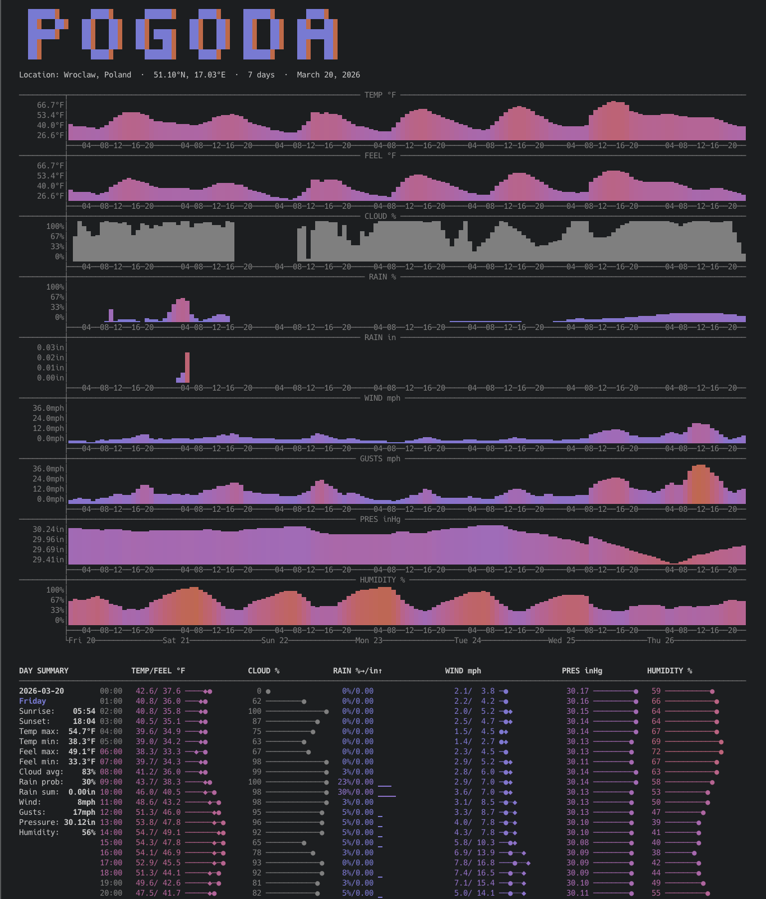

# Pogoda

**Terminal Weather Forecast** — v0.9

Pogoda is a Rust CLI that fetches hourly forecasts from [Open-Meteo](https://open-meteo.com) and renders a rich, color-coded report directly in your terminal. It shows area charts for the full forecast period and an hourly table with bars, all scaled to your terminal width. A dedicated drone pilot mode (`--i-drone-you`) shows wind at multiple altitudes, rain intensity, and UV index. Historical data going back decades is available via `--delorean`, with automatic hourly/daily/monthly rendering based on the date range.



More screenshots and full documentation: [github.com/akurczyk/pogoda](https://github.com/akurczyk/pogoda)

---

## Installation

**macOS (Homebrew):**

```bash
brew tap akurczyk/pogoda
brew install pogoda
```

**Build from source:**

```bash
cargo install pogoda
```

---

## Usage

```
pogoda <latitude> <longitude> [days]
pogoda <lat,lng> [days]
pogoda <city> [days]
```

`days` — forecast horizon, 1–16 (default: 7). Use `N-M` to show only days N through M (e.g. `3-7`).

---

## Modifiers

| Flag | Description |
|------|-------------|
| `--i-drone-you` | Drone pilot profile: wind at 10/80/120/180 m, rain intensity, UV index |
| `--delorean D1 D2` | Historical data from D1 to D2 (DD.MM.YYYY); auto-selects hourly/daily/monthly |
| `--strange-units` | American units: °F, mph, in, inHg |
| `--yes-sir` | British units: °C, mph, mm, hPa |
| `--i-am-blue` | Cool color palette (cyan → blue → indigo) |
| `--color-me` | Full spectrum palette (cyan → blue → indigo → red → orange) |
| `--classic-colors` | Classic palette (blue → cyan → green → yellow → orange → red) |
| `--rainforest` | Nature palette (cyan → green → lime) |
| `--i-cant-afford-cga` | Monochromatic output (no colors) |
| `--high-charts` | Taller overview charts (24 rows instead of 4) |
| `--no-charts` | Skip the overview charts |
| `--no-table` | Skip the hourly table |
| `--no-eyecandy` | Skip logo, location header and footer |
| `--tabular-bells` | Output CSV data instead of charts/table |

Modifiers can be combined freely. The warm indigo → red → orange palette is used by default.

---

## Examples

```bash
pogoda 52.52 13.41                                             # Berlin, 7 days
pogoda 51.10,17.00 14                                          # Wrocław by coordinates, 14 days
pogoda Wrocław                                                 # City name lookup
pogoda Wrocław 3-7                                             # Days 3 through 7
pogoda New York 5 --strange-units                              # American units
pogoda London 7 --yes-sir                                      # British units
pogoda Tokyo 10 --i-am-blue                                    # Cool color palette
pogoda Paris 3 --tabular-bells                                 # CSV output
pogoda Wrocław 7 --i-drone-you                                 # Drone pilot profile
pogoda Wrocław --delorean 01.01.2024 31.01.2024                # Historical hourly (≤31 days)
pogoda Berlin --delorean 01.01.2020 31.12.2020                 # Historical daily (≤365 days)
pogoda Warsaw --delorean 01.01.1980 20.09.2025 --rainforest    # Historical monthly, nature palette
```

---

## Data sources

- Weather data: [Open-Meteo](https://open-meteo.com) — free, open-source weather API
- Forward geocoding: [Open-Meteo Geocoding API](https://open-meteo.com/en/docs/geocoding-api)
- Reverse geocoding: [Nominatim / OpenStreetMap](https://nominatim.openstreetmap.org)

---

## License

BSD 2-Clause
