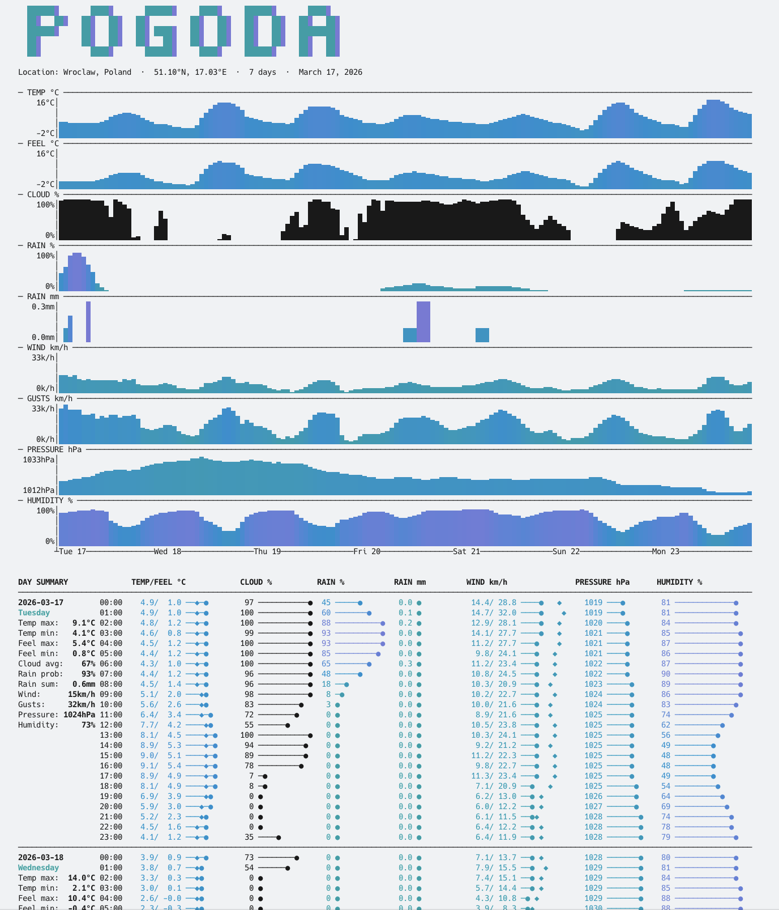
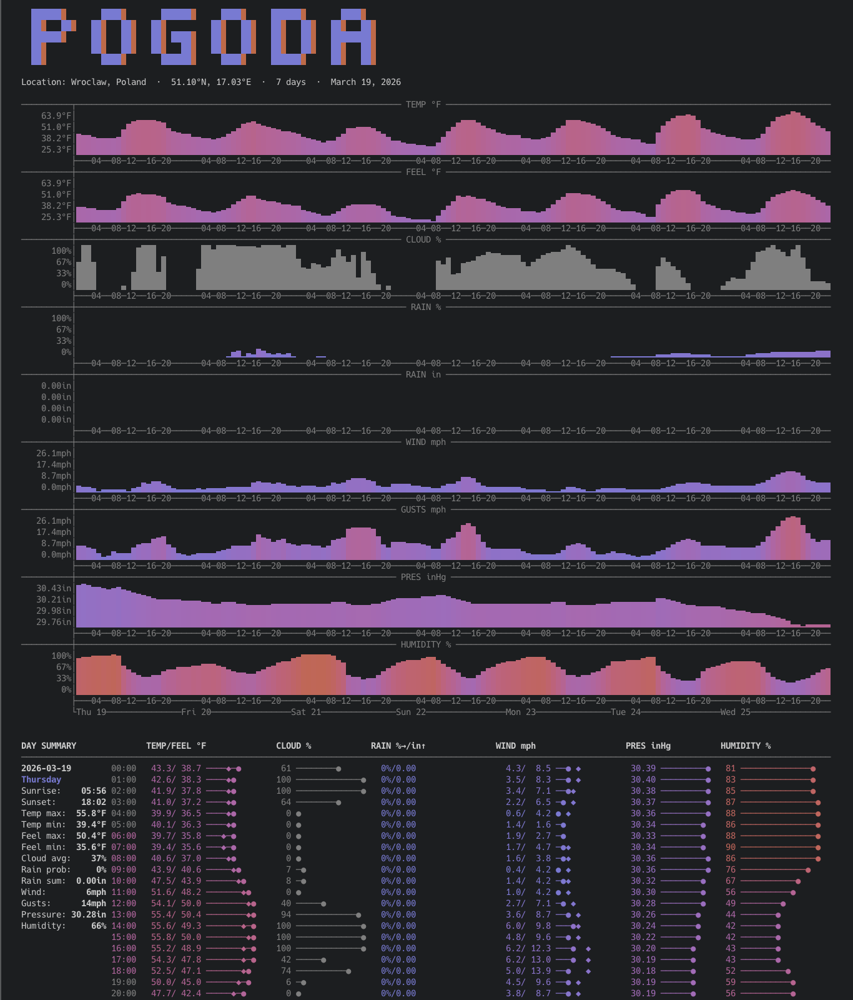
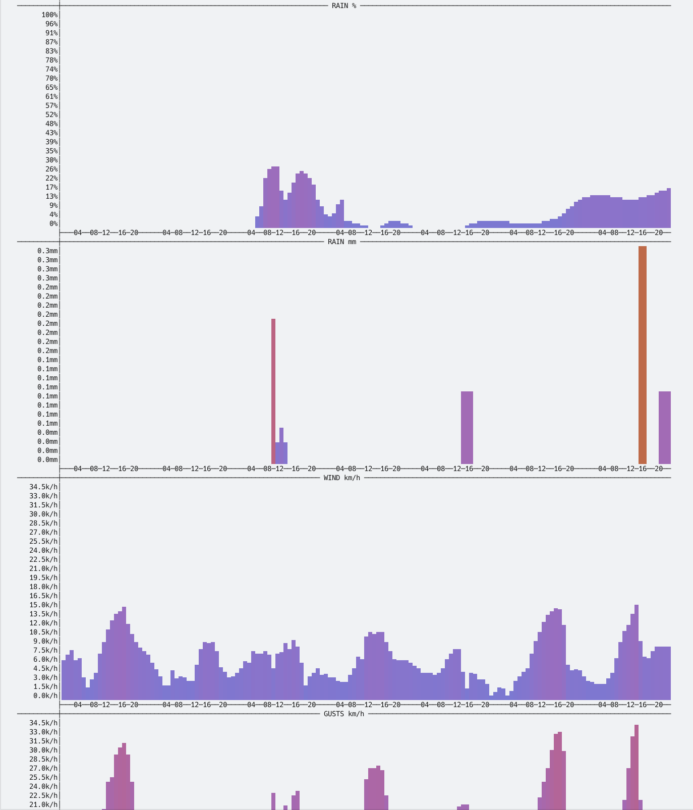

# Pogoda

**Terminal Weather Forecast** — v0.2

Pogoda is a Rust CLI that fetches hourly forecasts from [Open-Meteo](https://open-meteo.com) and renders a rich, color-coded report directly in your terminal. It shows area charts for the full forecast period and an hourly table with bars, all scaled to your terminal width.

---

## Screenshots

<table>
<tr>
<td width="50%">

**Default forecast**



7-day hourly view: temperature/feel, cloud cover, precipitation probability and amount, wind speed/gusts, pressure, and humidity. Cool cyan–blue–indigo palette enabled with `--i-am-blue` on light terminal background.

</td>
<td width="50%">

**American units — `--strange-units`**



Data in °F, mph, inches of rain, and inHg pressure. All charts and the hourly table update accordingly. Warm indigo → red → orange palette (default one) on a dark terminal background.

</td>
</tr>
</table>

<table>
<tr>
<td width="50%">

**High-resolution charts — `--high-charts`**



24-row charts with per-row scale labels for fine-grained reading of temperature, wind, pressure and other metrics.

</td>
<td width="50%">

</td>
</tr>
</table>

---

## Installation

**macOS (Homebrew):**

```bash
brew tap akurczyk/pogoda
brew install pogoda
```

**Download a pre-built binary** (Linux/macOS):

```bash
# Replace <version> and <target> with the appropriate values, e.g. v0.1.0 and x86_64-unknown-linux-musl
curl -L https://github.com/akurczyk/pogoda/releases/download/<version>/pogoda-<target>.tar.gz | tar -xz
sudo mv pogoda /usr/local/bin/
```

Available targets:

| Target | Platform |
|--------|----------|
| `x86_64-unknown-linux-musl` | Linux x86_64 |
| `i686-unknown-linux-musl` | Linux x86 (32-bit) |
| `aarch64-unknown-linux-musl` | Linux ARM64 |
| `x86_64-apple-darwin` | macOS Intel |
| `aarch64-apple-darwin` | macOS Apple Silicon |

**Build from source:**

```bash
git clone https://github.com/akurczyk/pogoda
cd pogoda
cargo build --release
# binary at ./target/release/pogoda
```

---

## Usage

```
pogoda <latitude> <longitude> [days]
pogoda <lat,lng> [days]
pogoda <city> [days]
```

`days` — forecast horizon, 1–16 (default: 7).

---

## Modifiers

| Flag | Description |
|------|-------------|
| `--strange-units` | American units: °F, mph, in, inHg |
| `--yes-sir` | British units: °C, mph, mm, hPa |
| `--i-am-blue` | Cool color palette (cyan → blue → indigo) |
| `--color-me` | Full spectrum palette (cyan → blue → indigo → red → orange) |
| `--i-cant-afford-cga` | Monochromatic output (no colors) |
| `--high-charts` | Taller overview charts (24 rows instead of 4) |
| `--no-charts` | Skip the overview charts |
| `--no-table` | Skip the hourly table |
| `--no-eyecandy` | Skip logo, location header and footer |
| `--tabular-bells` | Output CSV data instead of charts/table |

Modifiers can be combined freely. The warm indigo → red → orange palette is used by default; `--i-am-blue` switches to the cool cyan → blue → indigo palette.

---

## Examples

```bash
pogoda 52.52 13.41                          # Berlin, 7 days
pogoda 51.10,17.00 14                       # Wrocław by coordinates, 14 days
pogoda Wrocław                              # City name lookup
pogoda New York 5 --strange-units           # American units
pogoda London 7 --yes-sir                   # British units
pogoda Tokyo 10 --i-am-blue                 # Cool color palette
pogoda Berlin 7 --no-charts                 # Table only
pogoda Paris 3 --tabular-bells              # CSV output
```

---

## Data sources

- Weather data: [Open-Meteo](https://open-meteo.com) — free, open-source weather API
- Forward geocoding: [Open-Meteo Geocoding API](https://open-meteo.com/en/docs/geocoding-api)
- Reverse geocoding: [Nominatim / OpenStreetMap](https://nominatim.openstreetmap.org)

---

## License

BSD 2-Clause License

Copyright (c) 2026, pogoda contributors.

Redistribution and use in source and binary forms, with or without modification, are permitted provided that the following conditions are met:

1. Redistributions of source code must retain the above copyright notice, this list of conditions and the following disclaimer.

2. Redistributions in binary form must reproduce the above copyright notice, this list of conditions and the following disclaimer in the documentation and/or other materials provided with the distribution.

THIS SOFTWARE IS PROVIDED BY THE COPYRIGHT HOLDERS AND CONTRIBUTORS "AS IS" AND ANY EXPRESS OR IMPLIED WARRANTIES, INCLUDING, BUT NOT LIMITED TO, THE IMPLIED WARRANTIES OF MERCHANTABILITY AND FITNESS FOR A PARTICULAR PURPOSE ARE DISCLAIMED. IN NO EVENT SHALL THE COPYRIGHT HOLDER OR CONTRIBUTORS BE LIABLE FOR ANY DIRECT, INDIRECT, INCIDENTAL, SPECIAL, EXEMPLARY, OR CONSEQUENTIAL DAMAGES (INCLUDING, BUT NOT LIMITED TO, PROCUREMENT OF SUBSTITUTE GOODS OR SERVICES; LOSS OF USE, DATA, OR PROFITS; OR BUSINESS INTERRUPTION) HOWEVER CAUSED AND ON ANY THEORY OF LIABILITY, WHETHER IN CONTRACT, STRICT LIABILITY, OR TORT (INCLUDING NEGLIGENCE OR OTHERWISE) ARISING IN ANY WAY OUT OF THE USE OF THIS SOFTWARE, EVEN IF ADVISED OF THE POSSIBILITY OF SUCH DAMAGE.
