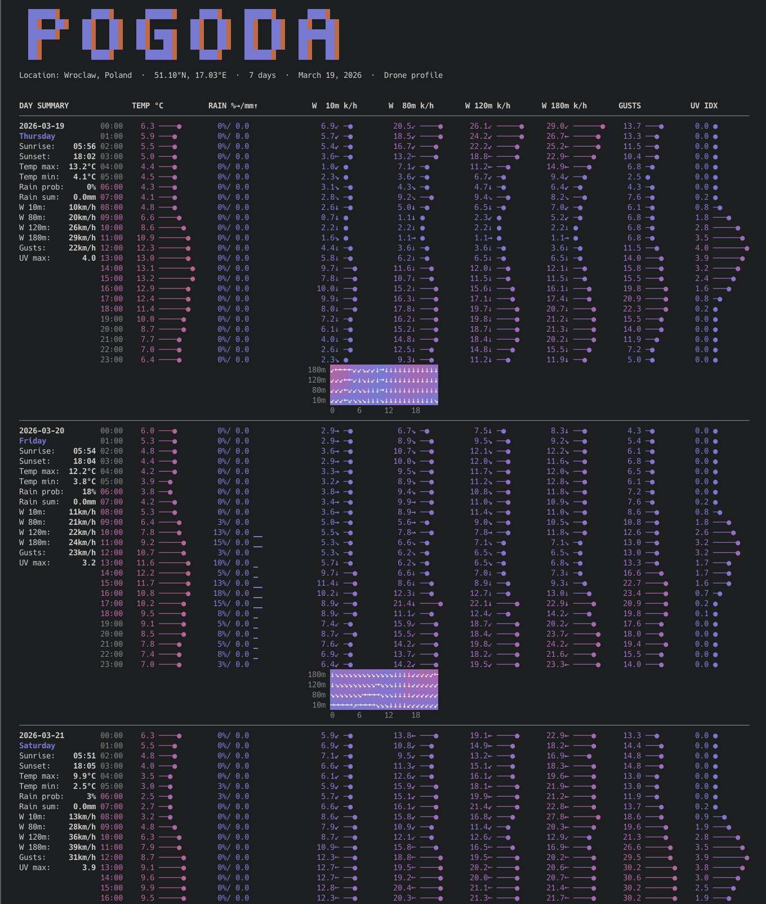

# Pogoda

**Terminal Weather Forecast** — v0.1

Pogoda is a Rust CLI that fetches hourly forecasts from [Open-Meteo](https://open-meteo.com) and renders a rich, color-coded report directly in your terminal. It shows area charts for the full forecast period and an hourly table with bars, all scaled to your terminal width.

---

## Screenshots

<table>
<tr>
<td width="50%">

**Default forecast**


7-day hourly view: temperature/feel, cloud cover, precipitation probability and amount, wind speed/gusts, pressure, and humidity. Color palette cycles between warm and cool randomly on each run.

</td>
<td width="50%">

**American units — `--strange-units`**


Same data in °F, mph, inches of rain, and inHg pressure. All charts and the hourly table update accordingly.

</td>
</tr>
<tr>
<td width="50%">

**Drone operator — `--i-drone-you`**



Wind at 10 m and 80 m altitude, wind direction, precipitation, visibility, and low cloud cover — prioritised for safe VLOS drone operations under EU UAS regulations.

</td>
<td width="50%">

**Pilot forecast — `--i-gonna-fly`**


Multi-level wind (10 m and 120 m), visibility, low/mid cloud cover, freezing level, CAPE, and QNH — designed for VFR light aircraft flight planning.

</td>
</tr>
</table>

---

## Installation

```bash
git clone https://github.com/akurczyk/pogoda
cd pogoda
cargo build --release
# binary at ./target/release/pogoda
```

Requires Rust 2024 edition (rustup update stable).

---

## Usage

```
pogoda <latitude> <longitude> [days]
pogoda <lat,lng> [days]
pogoda <city> [days]
```

`days` — forecast horizon, 1–16 (default: 7).

---

## Modifiers

| Flag | Description |
|------|-------------|
| `--strange-units` | American units: °F, mph, in, inHg |
| `--i-drone-you` | Drone operator profile: wind at altitude, visibility, low cloud |
| `--i-gonna-fly` | Pilot profile: multi-level wind, CAPE, icing level, cloud ceiling |
| `--i-am-not-blue` | Warm color palette (indigo → red → orange) |
| `--i-am-blue` | Cool color palette (cyan → blue → indigo) |

Modifiers can be combined freely. The cool blue palette is used by default; `--i-am-not-blue` switches to the warm palette.

---

## Examples

```bash
pogoda 52.52 13.41                          # Berlin, 7 days
pogoda 51.10,17.00 14                       # Wrocław by coordinates, 14 days
pogoda Wrocław                              # City name lookup
pogoda Paris 7 --i-gonna-fly               # Pilot view, Paris
pogoda New York 5 --strange-units          # American units
pogoda Tokyo 10 --i-drone-you --i-am-not-blue
```

---

## Data sources

- Weather data: [Open-Meteo](https://open-meteo.com) — free, open-source weather API
- Forward geocoding: [Open-Meteo Geocoding API](https://open-meteo.com/en/docs/geocoding-api)
- Reverse geocoding: [Nominatim / OpenStreetMap](https://nominatim.openstreetmap.org)

---

## License

BSD 2-Clause License

Copyright (c) 2026, pogoda contributors.

Redistribution and use in source and binary forms, with or without modification, are permitted provided that the following conditions are met:

1. Redistributions of source code must retain the above copyright notice, this list of conditions and the following disclaimer.

2. Redistributions in binary form must reproduce the above copyright notice, this list of conditions and the following disclaimer in the documentation and/or other materials provided with the distribution.

THIS SOFTWARE IS PROVIDED BY THE COPYRIGHT HOLDERS AND CONTRIBUTORS "AS IS" AND ANY EXPRESS OR IMPLIED WARRANTIES, INCLUDING, BUT NOT LIMITED TO, THE IMPLIED WARRANTIES OF MERCHANTABILITY AND FITNESS FOR A PARTICULAR PURPOSE ARE DISCLAIMED. IN NO EVENT SHALL THE COPYRIGHT HOLDER OR CONTRIBUTORS BE LIABLE FOR ANY DIRECT, INDIRECT, INCIDENTAL, SPECIAL, EXEMPLARY, OR CONSEQUENTIAL DAMAGES (INCLUDING, BUT NOT LIMITED TO, PROCUREMENT OF SUBSTITUTE GOODS OR SERVICES; LOSS OF USE, DATA, OR PROFITS; OR BUSINESS INTERRUPTION) HOWEVER CAUSED AND ON ANY THEORY OF LIABILITY, WHETHER IN CONTRACT, STRICT LIABILITY, OR TORT (INCLUDING NEGLIGENCE OR OTHERWISE) ARISING IN ANY WAY OUT OF THE USE OF THIS SOFTWARE, EVEN IF ADVISED OF THE POSSIBILITY OF SUCH DAMAGE.
